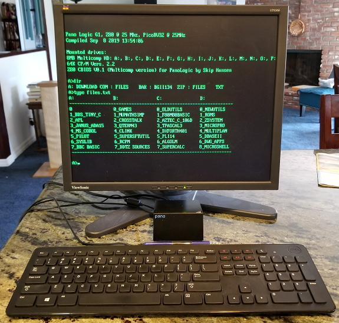
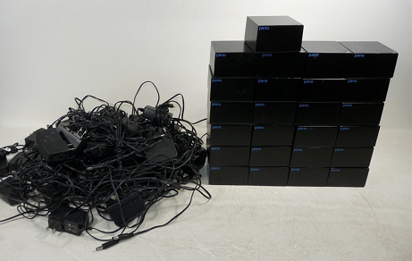
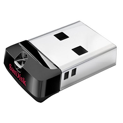

# Panopticon Gateware & Firmware for the Panologic Thin Client
 

This project creates a RiscV32 based computer from a Panologic thin client by 
loading a new bit image into the Pano FPGA, no other modifications are required.

Features:

- 25Mhz RiscV32i
- USB keyboard and VGA monitor for console 
- USB flash drive provides storage
- ANSI support for keyboard and monitor

## What is a Panologic device and why do I care?

Panologic was a Bay Area startup that manufactured tiny thin clients that 
were connected to a central server.  The Pano devices have a Ethernet 
interface, a few USB ports, audio input and output ports, and one or two 
video ports.  

The first generation (G1) Pano was based on the largest Xilinx Spartan-3E 
family chip and supported a single VGA monitor.  

The second generation (G2) supported two DVI monitors.  Revision A and B 
of the G2 devices were based on the Spartan-6 LX150 which is the largest 
chip in the family.  The revision C G2 device is based on the smaller 
LX100 device which is still quite large by hobbist standards.  

Unfortunately for Panologic, but fortunate for FPGA hobbyists Panologic 
went out of business in 2012.  Shortly thereafter **TONS** of both new and 
used Panologic devices started showing up on ebay for very little money 
since they were pretty much useless without support.  Even today (Aug
2020) both versions of the Panologic devices are still readily available 
on ebay for little. 

 

This project was derived from the work of Tom Verbeure, Wenting Zhang, and Skip Hansen.
Links to their projects can be found at the bottom of this page.

## Disk I/O


Disk I/O is provided by a USB flash drive. 

The standard FAT filesystem is used so there is no need to use special tools 
to write files to the drive.

## Video Subsystem

A simplified graphics controller has been implemented somewhat modeled after the GBA and similar game systems.

* A 256-entry global palette, where each entry is 24-bit color.

* Two Background "Text" Layers
  * Layer 0 supports 80x60, 128x32, 64x64, or 32x128 tile arrays, with various scaling modes.
    * 256 1-bit per pixel tile images, with each entry in the character map able to specify the background and foreground colors from the global palette.
  * Layer 1 supports 80x60, 128x32, 64x64, or 32x128 tile arrays, with various scaling modes.
    * 1024 4-bit per pixel tile images, with 16-bit character map entries similar to GBA's BG Map.

* Bitmap Background Layer
  Supports 128x64, 64x128 2-bit per pixel bitmap with an indirect palette for copper effects.

* Hardware Sprites
  Similar to GBA's OAM Sprites, but with some reduced functionality.

* All of the background layers support windowing, scaling, scrolling and priority.  Rotation may be added later.
  This can produce a poor man's version of the Amiga's draggable screens, drop-down text consoles, or similar effects.

* Reprogrammable output resolutions using the IDT clock generator to produce the pixel clock.

## HW Requirements

* A first generation Panologic thin client (G1, the one with a VGA port)
* A suitable 5 volt power supply
* A USB keyboard
* A USB Mass storage device
* A SPI programmer or A JTAG programmer to load the bitstream and program code into flash.

Two optional hardware addons can be used to expand the capacity of the system

* Panopticon Card provides switchable PSRAM for multi-boot and a small controller to switch between Flash & PSRAM.
* Flash daughtercard makes it easier to pull the SPI flash for reprogramming outside the unit, use like game cartridges.

Both of these modifications require relocating the SPI flash from the Panologic's board to a removable module that plugs into the SPI flash header (as well as reset & I2C for the Panopticon Card).

## Software Requirements

To program the supplied binary files you use either [xc3sprog](http://xc3sprog.sourceforge.net/)
or iMPACT included with Xilinx ISE 14.7.  

To say the very least xc3sprog is a smaller download, but you will need 
to built it from sources for your system.  I recommend that you install it 
even if you already have installed ISE. I have found xc3sprog to be easier to 
use, faster, and more reliable than iMPACT.

If you would like to modify fpga portion of the project you will definitely
need to download and install ISE.

The free Webpack version of Xilinx [ISE 14.7](https://www.xilinx.com/support/download/index.html/content/xilinx/en/downloadNav/vivado-design-tools/archive-ise.html) is used for development.
Do **NOT** download the latest Windows 10 version as it does not support the 
Spartan 3E family of chips used in the first generation of the Pano device.

## Installation

Installation is as simple as programming the SPI flash with a new image.
The image includes the bit stream for the FPGA as well as firmware for 
the RISC-V I/O processor.

Start out by cloning this [panoptiocon](https://github.com/dkgrizzly/panopticon.git) repository and changing directory into it.

```
$ git clone https://github.com/dkgrizzly/panopticon.git
Cloning into 'panopticon'...
remote: Enumerating objects: xx, done.
remote: Total xx (delta 0), reused 0 (delta 0), pack-reused xx
Receiving objects: 100% (xx/xx), xx.xx MiB | x.xx MiB/s, done.
Resolving deltas: 100% (xx/xx), done.
$ cd panopticon
$ 
```

### USB drive selection

The storage capacity of the USB flash drive isn't important, it's literally 
impossible to buy a drive that's too small these days. A 256 mb (not gigabyte!) 
drive is more than sufficient.

The exact degree of USB flash drive compatibility of the USB subsystem
is unknown, but it is expected to be reasonable. I have tested with several 
different devices and they all work, but they were are all "Bulk/Bulk/Bulk" 
type devices at the low level.  "Control/Bulk" and "Control/Bulk/Interrupt" 
type devices also exist, but I haven't found any to test with.

If a flash drive isn't recognized or doesn't work try a different one.

If you are worried about compatibility the specific device I'm using
is a [SanDisk Cruzer](https://www.amazon.com/gp/product/B005FYNSZA/ref=ppx_yo_dt_b_search_asin_title?ie=UTF8&psc=1) because it's tiny, cheap and a "name brand".

### USB drive preparation

...

### Programming the Pano flash using xc3sprog

Install xc3sprog for your system.  If a binary install isn't available for your
system the original project can be found here: https://sourceforge.net/projects/xc3sprog/.
Sources can be checked out using subversion from https://svn.code.sf.net/p/xc3sprog/code/trunk.

As an alternate if you don't have subversion a fork of the original project
can be found here: https://github.com/Ole2mail/xc3sprog.git .

If your JTAG cable is not a Digilent JTAG-HS2 cable then you will need to edit 
the toplevel Makefile and change XC3SPROG_OPTS for your device.

Refer to the supported hardware [web page](http://xc3sprog.sourceforge.net/hardware.php) page or run  xc3sprog -c 
to find the correct cable option for your device.

Now that hard part is over, just run make to flash the new Xilinx bit stream 
and firmware image

```
$ make
xc3sprog -c jtaghs2 -v -I./fpga/xc3sprog/pano_g1.bit ./xilinx/panopticon.mcs:W:0:MCS
XC3SPROG (c) 2004-2011 xc3sprog project $Rev: 774 $ OS: Linux
Free software: If you contribute nothing, expect nothing!
Feedback on success/failure/enhancement requests:
        http://sourceforge.net/mail/?group_id=170565
Check Sourceforge for updates:
        http://sourceforge.net/projects/xc3sprog/develop

Using built-in device list
Using built-in cable list
Cable jtaghs2 type ftdi VID 0x0403 PID 0x6014 Desc "Digilent USB Device" dbus data e8 enable eb cbus data 00 data 60
Using Libftdi, Using JTAG frequency   6.000 MHz from undivided clock
JTAG chainpos: 0 Device IDCODE = 0x21c3a093     Desc: XC3S1600E
Created from NCD file: top.ncd;UserID=0xFFFFFFFF
Target device: 3s1600efg320
Created: 2019/08/11 16:06:27
Bitstream length: 5969696 bits
done. Programming time 1022.5 ms
JEDEC: 20 20 0x14 0x10
Found Numonyx M25P Device, Device ID 0x2014
256 bytes/page, 4096 pages = 1048576 bytes total
Created from NCD file:
Target device:
Created:
Bitstream length: 6764640 bits
Erasing sector 13/13....Writing data page   3303/  3304 at flash page   3303..
Maximum erase time 635.4 ms, Max PP time 63536 us
Verifying page   3304/  3304 at flash page   3304
Verify: Success!
USB transactions: Write 16761 read 16394 retries 17404
xc3sprog -c jtaghs2 -v ./xilinx/work/pano_top.bit
XC3SPROG (c) 2004-2011 xc3sprog project $Rev: 774 $ OS: Linux
Free software: If you contribute nothing, expect nothing!
Feedback on success/failure/enhancement requests:
        http://sourceforge.net/mail/?group_id=170565
Check Sourceforge for updates:
        http://sourceforge.net/projects/xc3sprog/develop

Using built-in device list
Using built-in cable list
Cable jtaghs2 type ftdi VID 0x0403 PID 0x6014 Desc "Digilent USB Device" dbus data e8 enable eb cbus data 00 data 60
Using Libftdi, Using JTAG frequency   6.000 MHz from undivided clock
JTAG chainpos: 0 Device IDCODE = 0x21c3a093     Desc: XC3S1600E
Created from NCD file: pano_top.ncd;HW_TIMEOUT=FALSE;UserID=0xFFFFFFFF
Target device: 3s1600efg320
Created: 2019/10/15 09:03:47
Bitstream length: 5855264 bits
done. Programming time 1000.1 ms
USB transactions: Write 366 read 7 retries 8
$
```

### Programming the Pano flash using iMPACT

Use iMPACT to program .../xilinx/panopticon.msc into flash.

1. Start iMPACT (Selecting Tools/iMPACT from ISE's menu is one way).
2. Double click "Boundary Scan" under iMPACT flows.
3. Right click in the Boundary Scan window and select Initialize chain.
4. Dismiss the Auto Assign dialog box by clicking No.
5. Click Ok on the Device Programming properties dialog.
6. Right click the "SPI/BPI ?" box shown above the Xilinx chip and select 
"Add SPI/BPI flash"
7. Navigate to .../xilinx/panopticon.msc and click Open.
8. Select "M25P80" from the drop down box on the dialog and click OK.
9. Right click the "Flash" box shown above the Xilinx chip and select 
"program".
10. Click OK on the Device Programming Properties dialog.
11. Cross fingers and hope that the program operation will be successful.

## Booting

Now that the Pano has been updated and a USB flash drive is ready it's time
for the moment of truth.  Connect a USB keyboard and the USB flash drive to
the USB ports next to the VGA connector and connect a VGA monitor.  Do not use 
the USB port located next to the Ethernet port, it does not work currently 
(a bug for another day).

Now turn on power and hopefully you'll be greeted by a screen similar to
the one at the top of this page.

## Building Everything from Scratch

**NB:** While it may be possible to use Windows for development I haven't 
tried it and don't recommend it.

* Install the free Webpack version of Xilinx [ISE 14.7](https://www.xilinx.com/support/download/index.html/content/xilinx/en/downloadNav/design-tools/v2012_4---14_7.html)

* Follow the instruction in the [PicoRV32 repository](https://github.com/cliffordwolf/picorv32#building-a-pure-rv32i-toolchain) to install the riscv32ic toolchain.

* Clone this github repository into `~/panopticon` and change into the root of the repository

* Build the firmware for the RISC-V processor

```
(cd fw/firmware/;make)
```
This creates the file `~/panopticon/fw/firmware/firmware.bin`

* Fire up Xilinx ISE

* Create the bitstream `~/panopticon/xilinx/work/pano_top.bit`
    * File -> Open Project -> ~/panopticon/xilinx/panopticon.xise
    * Double click on 'Generate Programming File'

* Create the MSC "prom" file with the bit stream and firmware image
    * Start iMPACT
    * Click "No" to "Automatically create and save a project"
    * Open the iMPACT Project file ~/panopticon/xilinx/panopticon.ipf
    * Double click "Generate File..." under iMPACT Processes 

This should create `~/panopticon/xilinx/panopticon.mcs`.

### Useful Make targets for development

These targets assumed you have installed xc3sprog, if you haven't, well ...
then these won't be very useful after all.

Run "Make prog" from .../sw/firmware to build and program JUST the RISC-V
image.  This provides a very fast build/debug/edit/build cycle by 
eliminating the need to touch ISE or iMPACT.  A typical build/flash takes
less than 10 seconds.  

Run "Make reload" to just reload the current .bit file into the Xilinx.  It
is NOT programmed into flash. This provides an easy way to reset the
FPGA and RISC-V processor.

Run "Make prog_fpga" to just flash the current .bit file into the SPI flash.

Run "Make prog_all" from the top level directory to flash the current .bit file
and RISC-V firmware.

### RISC-V firmware debugging

The gateware includes two UARTs which can be used for debug i/o while debugging RISC-V firmware.
The debug serial port's format is 115200-n-8-1.

Moderate soldering skills are needed to connect a 3.3V compatible serial port to the underside of the board.
FPGA pins E1, E2, E3, E4 are the TX & RX pins for UART 0 & 1 respectively.

The log.h header includes several macros to make debugging easier.  Please refer
to the source for details.

## History


## Acknowledgement and Thanks

This project uses code and information from several other projects including:

 - [Tom Verbeure's Panologic efforts](https://github.com/tomverbeure/panologic)
 - [Skip Hansen's Pano Z80](https://github.com/skiphansen/pano_z80)
 - [Wenting Zhang's VerilogBoy](https://github.com/zephray/VerilogBoy)
 - [PicoRV32](https://github.com/cliffordwolf/picorv32)
 - [u-boot](https://github.com/u-boot/u-boot)
 - [unscii 8x8 Font](http://pelulamu.net/unscii/)
 - [Daniel Wallner's Z80 CPU core](https://opencores.org/projects/t80)
 - [ChaN's FatFs](http://elm-chan.org/fsw/ff/00index_e.html)
 - [Martin K. Schröder's VT100](https://github.com/mkschreder/avr-vt100)
 - [Martin Korth's GBAtek](https://problemkaputt.de/gbatek.htm)

## Pano Links

Links to other Panologic information can be found on the [Pano Hacker's Wiki](https://github.com/tomverbeure/panologic-g2/wiki#community)

## LEGAL 

My original work (the video subsystem), Skip Hansen's Pano Z80 project, and Wenting Zhang's Verilog Boy project
which they are based are released under the GNU Public License 2.0.

Wenting further acknowledged the following:

>The PicoRV32 is free and open hardware licensed under the [ISC license](http://en.wikipedia.org/wiki/ISC_license)
(a license that is similar in terms to the MIT license or the 2-clause BSD license).

>Some firmware code of pano-g1 target are released to public domain.

>All other software codes are licensed under GNU GPL 2.0.

>All other HDL codes are licensed under OHDL 1.0.

>All other text documents are licensed under CC BY-SA 4.0


>If you use this material in any way a reference to the author (me :-) ) 
will be appreciated.

